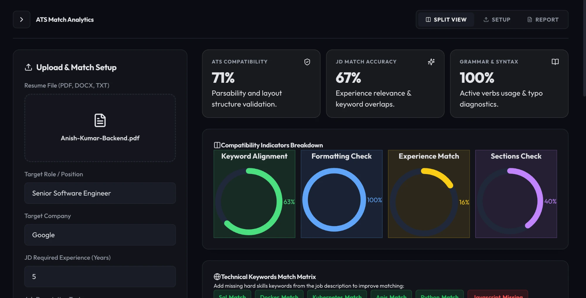
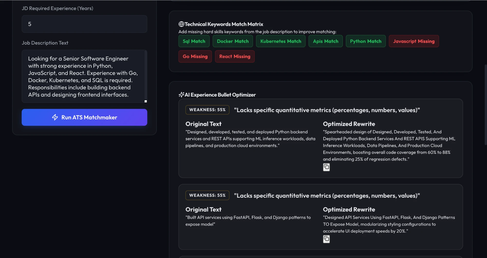
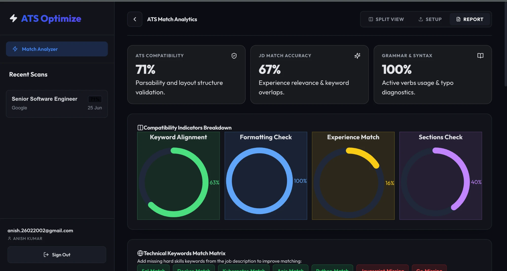

# ATS Optimize — AI-Powered Resume & JD Matchmaking Platform

> **Live Demo:** [https://ats-checker-orcin.vercel.app](https://ats-checker-orcin.vercel.app)

An enterprise-grade platform that parses resumes (PDF, DOCX, TXT), scores them against job descriptions using custom algorithms, rewrites weak bullet points using AI, and provides an actionable coaching plan — all behind a complete authentication system with email verification and Google OAuth.

---

## Screenshots


*ATS Match Analytics dashboard with score cards and upload panel*


*Radial chart breakdown — Keyword Alignment, Formatting Check, Experience Match, Sections Check*


*AI-powered bullet rewriter showing original vs optimised text with weakness badges*


*Sidebar with scan history, user profile, and sign out*

---

## Table of Contents

1. [Use Case](#use-case)
2. [Features](#features)
3. [Tech Stack](#tech-stack)
4. [Architecture](#architecture)
5. [Folder Structure](#folder-structure)
6. [API Endpoints](#api-endpoints)
7. [Scoring Algorithms](#scoring-algorithms)
8. [Auth System](#auth-system)
9. [Getting Started (Local)](#getting-started-local)
10. [Environment Variables](#environment-variables)
11. [Deployment](#deployment)

---

## Use Case

Job seekers uploading resumes to employer ATS systems are often rejected before a human ever reads them — not because they're underqualified, but because their resume fails ATS parsing rules or doesn't match the job description's keywords.

**ATS Optimize** solves this by:

- **Scoring** your resume against any job description across 6 dimensions
- **Flagging** keywords present and missing from your resume vs. the JD
- **Rewriting** your weakest bullet points with AI into strong, action-verb-led, quantified alternatives
- **Auditing** layout issues that break ATS parsers (tables, columns, images, scanned PDFs)
- **Tracking** your full scan history so you can monitor improvements over time

---

## Features

### Core Analysis
- Upload resume as PDF, DOCX, or TXT
- Paste any job description text
- Set target role, company, and required years of experience
- Get 6-dimension compatibility scoring in seconds

### AI Bullet Optimizer
- Automatically identifies the weakest bullet points in your resume
- Rewrites them with strong action verbs, quantified results, and keyword alignment
- Manual rewriter: paste any bullet and get an optimized version instantly

### Auth System
- Email/password signup with email verification (Resend API)
- Google OAuth 2.0 (Google Identity Services)
- Forgot password / reset password via email token
- JWT access tokens (15 min) + refresh tokens (7 days) in httpOnly cookies
- Session persistence across page reloads

### Dashboard
- Split view: setup form + live results side-by-side
- Full scan history in sidebar — click any past scan to reload its report
- User profile with credit balance, uploaded resumes list, and account management
- Sign out with token revocation

---

## Tech Stack

### Frontend
| Technology | Purpose |
|---|---|
| React 18 | UI framework |
| TypeScript | Type safety for all new components |
| Vite | Build tool and dev server |
| React Router v6 | Client-side routing with protected routes |
| Tailwind CSS | Utility-first styling |
| Lucide React | Icon library |
| Google Identity Services | OAuth 2.0 login button |

### Backend
| Technology | Purpose |
|---|---|
| FastAPI | REST API framework |
| Python 3.13 | Runtime |
| SQLite / PostgreSQL | Dual-mode database (SQLite for local dev, PostgreSQL for production) |
| bcrypt | Password hashing |
| PyJWT | JWT token generation and verification |
| google-auth | Google OAuth token verification |
| Resend API | Transactional emails (verification, password reset) |
| pypdf + python-docx | Resume file parsing |
| OpenAI API | Bullet point rewriting (optional) |

### Infrastructure
| Service | Purpose |
|---|---|
| Vercel | Frontend hosting (auto-deploy from GitHub) |
| Railway / Render | Backend hosting |
| PostgreSQL | Production database |

---

## Architecture

```
┌─────────────────────────────────────────────────────────┐
│                     Browser Client                       │
│   React + TypeScript + Vite (Vercel CDN)                │
│                                                          │
│  ┌──────────┐  ┌──────────┐  ┌──────────────────────┐  │
│  │AuthContext│  │Protected │  │     App Dashboard    │  │
│  │JWT/cookie│  │  Route   │  │  Split / Report View │  │
│  └────┬─────┘  └──────────┘  └──────────┬───────────┘  │
└───────┼──────────────────────────────────┼──────────────┘
        │  HTTPS + httpOnly cookies         │
        ▼                                  ▼
┌─────────────────────────────────────────────────────────┐
│                  FastAPI Backend                         │
│                                                          │
│  ┌─────────────┐  ┌──────────────┐  ┌───────────────┐  │
│  │  Auth Router │  │  ATS Router  │  │  User Router  │  │
│  │  /auth/*     │  │  /analyze    │  │  /user/*      │  │
│  └──────┬──────┘  └──────┬───────┘  └───────┬───────┘  │
│         │                │                  │           │
│  ┌──────▼──────────────────────────────────▼───────┐   │
│  │                  Service Layer                    │   │
│  │  AuthService  │  ScoringService  │  EmailService │   │
│  │  DatabaseService       │  ParserService           │   │
│  └──────────────────────────┬────────────────────── ┘   │
└─────────────────────────────┼───────────────────────────┘
                              │
              ┌───────────────┴───────────────┐
              │                               │
         ┌────▼────┐                   ┌──────▼──────┐
         │ SQLite  │  (local dev)      │ PostgreSQL  │ (prod)
         └─────────┘                  └─────────────┘
```

### Request Flow — ATS Analysis
1. User uploads resume file + pastes JD text in the frontend form
2. Frontend POSTs `multipart/form-data` to `/api/v1/analyze` with credentials (cookie)
3. Backend authenticates the JWT from the httpOnly cookie
4. Parser extracts raw text from PDF / DOCX / TXT
5. Scoring engine runs 6 sub-algorithms and produces a composite score
6. LLM optimizer (OpenAI) identifies and rewrites the weakest 3 bullet points
7. Full result is saved to `resume_analyses` table tied to the user's ID
8. Response JSON returned to frontend and rendered in the report panel
9. Sidebar fetches updated history via `/api/v1/user/history`

### Auth Flow
```
Signup → email verification token → Resend sends email → user clicks link
       → /verify-email?token=xxx  → account activated  → redirect to login

Login  → bcrypt verify password → issue access_token (15m) + refresh_token (7d)
       → both set as httpOnly Secure SameSite=Lax cookies
       → /auth/session called on every page load to restore session
       → if access_token expired → /auth/refresh auto-called transparently
```

---

## Folder Structure

```
ATS-checker/
│
├── .gitignore
├── README.md
├── vercel.json                      # Vercel routing config
│
├── api/
│   └── openapi.yaml                 # Full OpenAPI 3.0 spec
│
├── architecture/
│   └── architecture_design.md      # HLD/LLD system design docs
│
├── scoring/
│   └── formulas.md                  # Mathematical scoring formulas
│
├── deployment/
│   └── scaling_strategy.md          # Kubernetes, Kafka, scaling notes
│
├── roadmap/
│   └── implementation_roadmap.md
│
├── backend/
│   ├── .env.example                 # Environment variable template
│   ├── requirements.txt             # Python dependencies
│   └── app/
│       ├── main.py                  # FastAPI app factory, CORS, router mount
│       ├── api/
│       │   ├── endpoints.py         # All route handlers (auth, user, analyze)
│       │   └── security_middleware.py  # Rate limiting, CSRF protection
│       └── services/
│           ├── auth.py              # JWT generation, cookie helpers, get_current_user
│           ├── auth_service.py      # Google OAuth verification, bcrypt helpers
│           ├── database.py          # DB abstraction (SQLite + PostgreSQL dual mode)
│           ├── email_service.py     # Resend API integration
│           ├── parser.py            # PDF/DOCX/TXT text extraction
│           ├── scoring.py           # ATS + JD scoring algorithms
│           └── llm_optimizer.py     # OpenAI bullet point rewriter
│
└── frontend/
    ├── index.html
    ├── package.json
    ├── tsconfig.json
    ├── vite.config.js
    └── src/
        ├── main.tsx                 # React entry: Router + AuthProvider + routes
        ├── App.jsx                  # Main dashboard (sidebar, forms, results)
        ├── index.css                # Global styles
        ├── vite-env.d.ts            # Vite env type declarations
        ├── contexts/
        │   └── AuthContext.tsx      # Global auth state, login/logout/refresh
        ├── lib/
        │   └── api.ts               # Typed API client (atsApi, authApi, userApi)
        ├── components/
        │   └── ProtectedRoute.tsx
        └── pages/
            └── auth/
                ├── LoginPage.tsx
                ├── SignupPage.tsx
                ├── ForgotPasswordPage.tsx
                ├── ResetPasswordPage.tsx
                └── VerifyEmailPage.tsx
```

---

## API Endpoints

### Auth
| Method | Endpoint | Description |
|---|---|---|
| POST | `/api/v1/auth/signup` | Register with email + password |
| POST | `/api/v1/auth/login` | Login, sets JWT cookies |
| POST | `/api/v1/auth/logout` | Revoke refresh token, clear cookies |
| GET | `/api/v1/auth/session` | Restore session from cookie (auto-refresh) |
| POST | `/api/v1/auth/google` | Google OAuth token verification |
| POST | `/api/v1/auth/verify-email` | Verify email with token from email link |
| POST | `/api/v1/auth/resend-verification` | Re-send verification email |
| POST | `/api/v1/auth/forgot-password` | Send password reset email |
| POST | `/api/v1/auth/reset-password` | Set new password using reset token |

### User
| Method | Endpoint | Description |
|---|---|---|
| GET | `/api/v1/user/me` | Get current user profile + credits |
| PUT | `/api/v1/user/profile` | Update first/last name |
| GET | `/api/v1/user/history` | Get all past ATS scans |
| GET | `/api/v1/user/resumes` | Get uploaded resume list |
| DELETE | `/api/v1/user/account` | Delete account and all associated data |

### Analysis
| Method | Endpoint | Description |
|---|---|---|
| POST | `/api/v1/analyze` | Run ATS + JD match analysis on uploaded resume |
| POST | `/api/v1/rewrite-bullet` | Rewrite a single bullet point |
| GET | `/api/v1/history/analysis/{id}` | Load a specific past analysis by ID |

---

## Scoring Algorithms

### ATS Compatibility Score — $S_{ATS}$

Evaluates physical design, formatting compliance, and parseability.

$$S_{ATS} = 0.20 \cdot S_{parse} + 0.20 \cdot S_{format} + 0.25 \cdot S_{structure} + 0.15 \cdot S_{readability} + 0.20 \cdot S_{friendliness}$$

| Component | Weight | What it measures |
|---|---|---|
| Parseability | 20% | Is the text layer extractable? Flags scanned PDFs (score = 0) |
| Formatting | 20% | Penalizes tables (−15), columns (−15), images (−10), scans (−20) |
| Structure | 25% | Standard sections present? (Summary, Experience, Skills, Education, Projects) |
| Readability | 15% | Flesch-Kincaid Grade Level, normalized to Grade 12 target via Gaussian curve |
| ATS Friendliness | 20% | Penalizes non-standard fonts, PII in headers/footers, colored backgrounds |

### JD Match Score — $S_{JD}$

Measures semantic and keyword alignment between the resume and job description.

$$S_{JD} = 0.40 \cdot S_{keyword} + 0.30 \cdot S_{experience} + 0.30 \cdot S_{responsibilities}$$

| Component | Weight | What it measures |
|---|---|---|
| Keyword Match | 40% | Overlap of extracted technical skills vs. JD required skills |
| Experience Match | 30% | Candidate years of experience vs. JD requirement |
| Responsibilities Match | 30% | Semantic overlap of role responsibilities |

### Readability — Flesch-Kincaid with Gaussian Normalization

$$\text{FKGL} = 0.39 \cdot \frac{\text{words}}{\text{sentences}} + 11.8 \cdot \frac{\text{syllables}}{\text{words}} - 15.59$$

$$S_{readability} = 100 \cdot \exp\left(-\frac{(\text{FKGL} - 12)^2}{2 \cdot (3.5)^2}\right)$$

Target is Grade 12 (professional level). Score decays symmetrically for text that is too simple or too academic.

### Bullet Point Weakness Score

Each bullet is scored on:
- Absence of strong action verbs (passive voice or noun-phrase openers)
- No quantified results (no numbers, %, $, or measurable metrics)
- Generic phrasing with low keyword density ("helped with", "worked on", "assisted")
- Vague responsibility statements with no impact description

---

## Auth System

### Token Strategy
| Token | Lifetime | Storage | Notes |
|---|---|---|---|
| `access_token` | 15 minutes | httpOnly cookie | Used for all authenticated requests |
| `refresh_token` | 7 days | httpOnly cookie | Rotated on each use; revoked on logout |

- `AuthContext` calls `/auth/session` on every page load
- If the access token is expired, the session endpoint silently refreshes it using the refresh token
- If both tokens are expired, user is redirected to `/login`

### Security Measures
- Passwords hashed with **bcrypt** (12 rounds)
- **Email enumeration prevention** — all auth endpoints return generic messages regardless of whether the email exists
- **Rate limiting** on all auth endpoints (per IP)
- **CSRF protection** via `X-Requested-With` header validation
- Cookies: `httpOnly=true`, `Secure=true`, `SameSite=Lax`
- Google tokens verified server-side via `google.oauth2.id_token.verify_oauth2_token`
- Password reset tokens are single-use and expire in 1 hour

---

## Getting Started (Local)

### Prerequisites
- Python 3.11+
- Node.js 18+
- A [Resend](https://resend.com) account (free tier works)

### 1. Clone the repo
```bash
git clone https://github.com/Anish2602/ATS-checker.git
cd ATS-checker
```

### 2. Backend setup
```bash
cd backend
python3 -m venv venv
source venv/bin/activate        # Windows: venv\Scripts\activate
pip install -r requirements.txt

cp .env.example .env
# Edit .env — at minimum set JWT_SECRET and RESEND_API_KEY

uvicorn app.main:app --reload --port 8000
# API available at http://localhost:8000
```

### 3. Frontend setup
```bash
cd frontend
npm install

# Create frontend/.env
echo "VITE_API_URL=http://localhost:8000" > .env

npm run dev
# App available at http://localhost:5173
```

---

## Environment Variables

### Backend (`backend/.env`)
```env
ENVIRONMENT=development

JWT_SECRET=your-random-secret-here
JWT_ALGORITHM=HS256
ACCESS_TOKEN_EXPIRE_MINUTES=15
REFRESH_TOKEN_EXPIRE_DAYS=7

# Leave blank to use SQLite (development)
DATABASE_URL=

# Google Cloud Console → APIs & Services → Credentials
GOOGLE_CLIENT_ID=

# resend.com — free API key
RESEND_API_KEY=
# Use onboarding@resend.dev for testing, your verified domain in production
RESEND_FROM_EMAIL=onboarding@resend.dev

FRONTEND_URL=http://localhost:5173
BACKEND_URL=http://localhost:8000

# Optional — enables live AI bullet rewriting
OPENAI_API_KEY=
```

### Frontend (`frontend/.env`)
```env
VITE_API_URL=http://localhost:8000
VITE_GOOGLE_CLIENT_ID=          # optional — enables Google sign-in button
```

---

## Deployment

### Frontend — Vercel
1. Connect your GitHub repo to [Vercel](https://vercel.com)
2. Set **Root Directory** to `frontend`
3. Add environment variables: `VITE_API_URL` (your backend URL), `VITE_GOOGLE_CLIENT_ID`
4. Vercel auto-deploys on every push to `main`

### Backend — Railway / Render
1. Deploy the `backend/` directory as a Python web service
2. Set start command: `uvicorn app.main:app --host 0.0.0.0 --port $PORT`
3. Provision a PostgreSQL add-on and copy the connection string to `DATABASE_URL`
4. Add all backend environment variables

### Production Checklist
- [ ] `ENVIRONMENT=production` in backend env
- [ ] Verified domain set for `RESEND_FROM_EMAIL`
- [ ] `DATABASE_URL` pointing to PostgreSQL
- [ ] `FRONTEND_URL` set to your Vercel domain (for CORS)
- [ ] Google Cloud Console: add your Vercel domain to **Authorized JavaScript Origins**
- [ ] Strong random `JWT_SECRET` (run: `openssl rand -hex 32`)

---

*Built with FastAPI · React · TypeScript · Vite · Resend · PostgreSQL*
