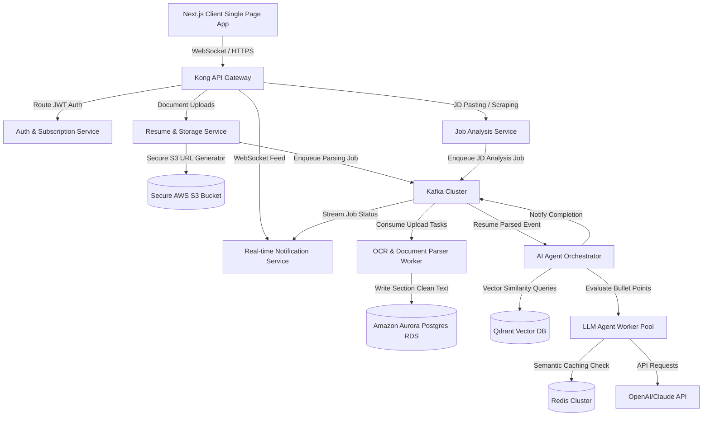
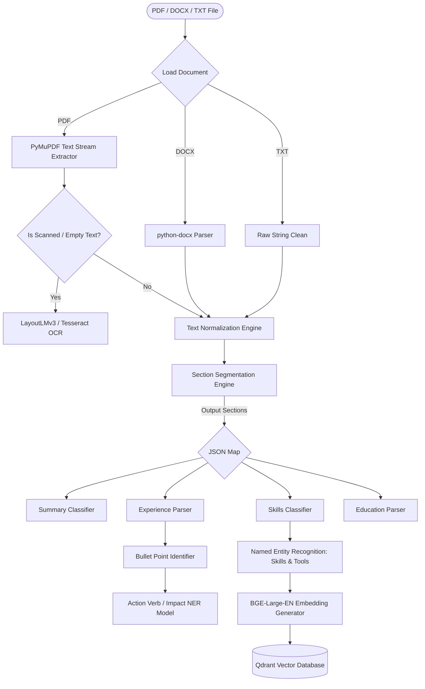
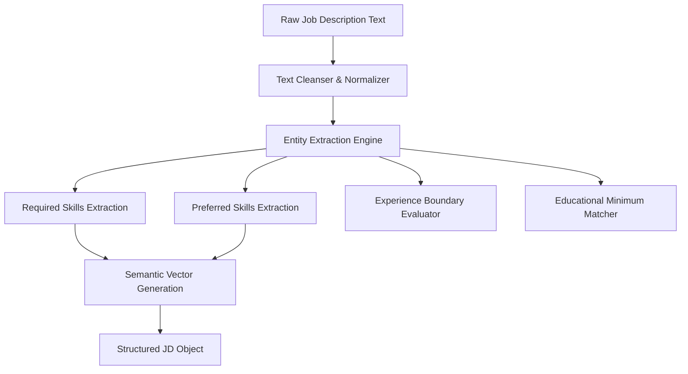

# System Architecture & AI Workflows Design

This document details the high-level system components and low-level AI pipeline workflows for the Enterprise-Grade ATS Resume Analyzer & JD Matchmaking Platform.

---

## 1. High-Level System Architecture

The platform uses a containerized microservices architecture built on **AWS EKS**, deploying decoupled workers orchestrated via **Apache Kafka** to isolate compute-intensive workloads (OCR, NLP Parsing, and LLM orchestration).

### Component Block Diagram


### Key Service Components
1.  **Kong API Gateway**: Manages rate-limiting, CORS, SSL termination, and routes authentication validation via JWT tokens.
2.  **Resume & Storage Service**: Written in Go/FastAPI. It accepts resume documents, runs validation on file formats (accepting only `.pdf`, `.docx`, `.txt`), generates temporary secure pre-signed URLs for AWS S3 uploads, and stores metadata in PostgreSQL.
3.  **OCR & Document Parser Worker**: Python-based worker using PyMuPDF and python-docx. If a PDF is image-only, it routes the processing to OCR workers running Tesseract or Google Cloud Vision API.
4.  **AI Agent Orchestrator**: Uses **LangGraph** or **Temporal.io** to manage stateful, multi-agent workflows. It ensures that if one agent fails (e.g., Grammar Agent timeout), it retries without restarting the parsing or keyword matching steps.
5.  **Real-Time Notification Service (WebSockets)**: Built using Socket.io or FastAPI WebSockets. Since LLM evaluations can take up to 8 seconds, it feeds progress indicators back to the client dashboard in real-time (e.g., "Parsing Document... [15%]", "Evaluating Skills... [50%]", "Rewriting Bullet Points... [85%]").

---

## 2. Low-Level AI Pipelines

Processing resume documents and extracting structured intelligence is divided into two primary pipelines: the **Resume Parsing Pipeline** and the **Job Description (JD) Parsing Pipeline**.

### Resume Parsing Pipeline Workflow


#### Detailed Pipeline Stages
1.  **Loading & OCR Branch**:
    *   For PDFs, PyMuPDF extracts characters. If the extracted word count is `< 50` or the ratio of non-printable character codes is high, it flags the document as scanned and runs LayoutLMv3 or Tesseract OCR.
2.  **Text Normalization**:
    *   Normalizes unicode spacing, converts ligatures (e.g., `fi` to `fi`), removes non-standard bullets, and strips trailing control characters.
3.  **Section Segmentation (Heuristics + ML)**:
    *   A hybrid model detects boundaries. We search for standard headings (`EXPERIENCE`, `WORK HISTORY`, `EDUCATION`, `SKILLS`) using regular expression heuristics and verify using a SciBERT-based token classification sequence classifier to identify section blocks.
4.  **Named Entity Recognition (NER)**:
    *   Uses a customized spaCy pipeline trained on resume corpuses to tag `SKILL`, `TECHNOLOGY`, `ROLE`, `COMPANY`, `YEARS_EXP`, and `DEGREE` entities.
5.  **Vector Embeddings Generation**:
    *   Generates 1024-dimension embeddings using `bge-large-en-v1.5` or 1536-dimension embeddings using OpenAI `text-embedding-3-small` for semantic comparisons.

---

### Job Description (JD) Parsing Pipeline


*   **Requirement Classifier**: Splitting JD sentences into "Required" (e.g., "Must have 5+ years of React experience") vs. "Preferred" (e.g., "Experience with Kubernetes is a plus") based on dependency parsing (checking for auxiliary verbs like *must, should, required* vs *plus, preferred, optional*).
*   **Seniority Detection**: Analyzes job titles and requirement terms to map the role to a normalized seniority level (`Junior`, `Mid`, `Senior`, `Lead`, `Staff`, `Executive`).

---

## 3. Core Matching Mechanism

To generate the Match Score, the system combines **lexical index searches** (BM25 exact keyword matches) with **semantic vector searches** (cosine similarities).

```
Match Score = [Lexical Score (BM25 exact match) * 0.40] + [Semantic Similarity (Cosine Distance) * 0.60]
```

### Benefits of the Hybrid Matching Model:
1.  **Prevents Synonyms Penalization**: If a job description asks for "REST API" and the candidate writes "RESTful Web Services", the semantic engine detects similarity close to 0.98. A strict keyword parser would score this as 0.
2.  **Suppresses Keyword Stuffing**: Candidates cannot artificially boost scores by pasting invisible keywords. The semantic vector represents the contextual structure of their experience, not just the word frequencies.
