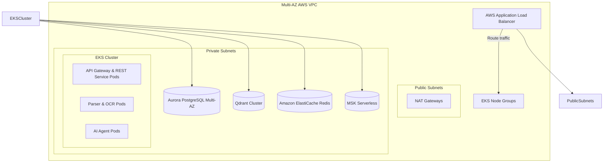

# Production Deployment & Scaling Strategy (1M+ Active Users)

This document details the target cloud architecture, container configurations, queue management, caching layers, and database scaling designs required to run the ATS platform at scale.

---

## 1. Kubernetes & Infrastructure Provisioning

The application runs in **AWS EKS** managed via Terraform, spanning three Availability Zones (AZs) for high availability.



### Auto-Scaling with Karpenter
Instead of standard cluster-autoscalers (which suffer from slow boot delays), we utilize **Karpenter** for node lifecycle provisioning.
*   **Provisioner Rules**:
    *   REST APIs and lightweight microservices run on cost-efficient **spot instances** (`c6i.xlarge` or `m6i.xlarge` instance families).
    *   Document Parsing and OCR Workers (which run CPU-bound extraction and local neural models) run on compute-optimized instances (`c6i.2xlarge` or `c7g.2xlarge` for ARM-based performance).
    *   AI Agent Workers run on standard memory-optimized instances (`r6i.xlarge`) to hold state machines.
*   **Scale Down Trigger**: Karpenter terminates empty nodes within 30 seconds to optimize costs.

---

## 2. Queueing & Asynchronous Processing

To handle spikes in resume uploads without performance degradation, the document processing pipeline uses **Apache Kafka** (AWS MSK Serverless).

### Kafka Topic Architecture & Partitioning
We define distinct topics with optimized partitioning:
*   `resume-uploads`: 12 Partitions. Key: `tenant_id` (ensures order is maintained per user/workspace).
*   `resume-parsed-events`: 12 Partitions.
*   `llm-analysis-jobs`: 24 Partitions. High partitions allow for parallel processing by AI agent workers.

```
Upload Resume ──> REST API ──> Publish [resume-uploads] ──> Parser Workers ──> Publish [resume-parsed-events] ──> Agent Orchestrator ──> Client (via WebSocket)
```

### Handling Backpressure
If a user uploads a batch of resumes (e.g., an enterprise recruiter uploading 1,000 profiles), we prevent resource exhaustion through:
1.  **Consumer Lag Autoscaling**: Prometheus monitors consumer group lag. If `resume-uploads` lag exceeds 50 messages, Kubernetes HPA scales up parsing worker pods from a minimum of 2 to a maximum of 48.
2.  **Rate Limiting Policy**: Free tier users are throttled to 3 uploads per minute; Pro tier to 30 per minute; Enterprise is managed via dedicated ingress queues.

---

## 3. Caching & Database Performance

### A. Semantic LLM Cache (Redis VL)
To avoid redundant LLM calls for bullet point optimizations, we implement semantic caching. When a candidate requests a rewrite for a bullet point, we check a Redis vector cache:

```python
# Semantic caching query execution example
from redis.commands.search.query import Query

def check_semantic_cache(redis_client, bullet_embedding):
    # Search Redis vector index using Cosine Distance threshold <= 0.04 (Similarity >= 0.96)
    query = (
        Query("(*)=>[KNN 1 @vector $vec AS distance]")
        .return_fields("improved_text", "distance")
        .sort_by("distance")
        .dialect(2)
    )
    results = redis_client.ft("bullet_cache").search(query, {"vec": bullet_embedding.tobytes()})
    
    if results.docs and float(results.docs[0].distance) <= 0.04:
        return results.docs[0].improved_text
    return None
```
This semantic cache reduces LLM token costs by up to 40% for recurring resumes and repetitive bullet structures.

### B. Vector DB Tuning (Qdrant & pgvector HNSW)
For candidate benchmarking comparisons, high-dimensional vector search latency must remain low.
*   **pgvector configurations**:
    We build HNSW indexes with `m=16` and `ef_construction=64` to balance build speed and search recall.
    ```sql
    CREATE INDEX idx_benchmarks_skills_hnsw 
    ON candidate_benchmarks 
    USING hnsw (skill_vector vector_cosine_ops) 
    WITH (m = 16, ef_construction = 64);
    ```
*   **Connection Pooling**: We deploy **PgBouncer** in transaction pooling mode to handle spikes in concurrent queries.

---

## 4. Rate Limiting & Edge Security

*   **API Rate Limiting**: Implemented at the Kong API Gateway using a **Token Bucket** algorithm backed by Redis.
*   **WAF Controls**: AWS WAF blocks scrapers, sql injection patterns, and limits requests from suspicious IP address spaces.
*   **Storage Access Isolation**: Resumes uploaded to S3 are stored in buckets with blocked public access. Access is granted exclusively using temporary **IAM Pre-Signed URLs** valid for 15 minutes.
*   **Data Masking**: Before parsing text is passed to external LLM providers (OpenAI/Claude), an inline pre-processing worker strips common PII markers (e.g., Phone numbers, Physical addresses, and precise Social Security patterns) using spaCy regex entities.
