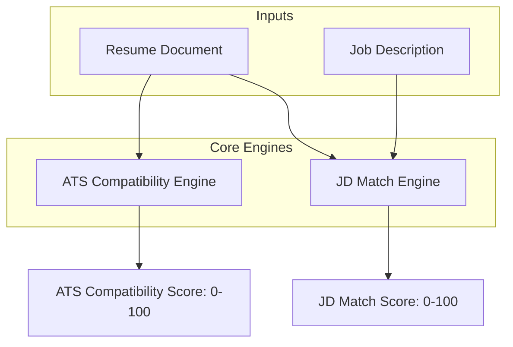

# Scoring Engine: Mathematical Formulations & Algorithms

This document provides the mathematical specifications and execution algorithms for the ATS Compatibility Score, Job Description Match Score, and individual component evaluations.

---

## 1. Overall Scoring Architecture

All scores are mapped to the interval $[0, 100]$. The final composite engine uses standard normalization techniques to prevent extreme outliers from skewing results.

---

## 2. ATS Compatibility Score ($S_{ATS}$)

The ATS Compatibility Score evaluates the physical design, formatting compliance, structural clarity, and general parseability of the resume.

$$S_{ATS} = w_{parse} \cdot S_{parse} + w_{format} \cdot S_{format} + w_{structure} \cdot S_{structure} + w_{readability} \cdot S_{readability} + w_{friendliness} \cdot S_{friendliness}$$

Where the weight configuration is:
*   $w_{parse} = 0.20$
*   $w_{format} = 0.20$
*   $w_{structure} = 0.25$
*   $w_{readability} = 0.15$
*   $w_{friendliness} = 0.20$

### A. Parseability Score ($S_{parse}$)
Evaluates the technical validity of the text extraction stream.
$$S_{parse} = 100 \cdot \left( 1 - \frac{N_{malformed\_chars} + N_{unknown\_glyphs}}{N_{total\_chars}} \right)$$
If a PDF file contains no selectable text (empty text layer), $S_{parse} = 0$, triggering OCR workflows.

### B. Formatting Score ($S_{format}$)
Penalizes formatting elements that break parser algorithms.
$$S_{format} = \max\left(0, 100 - \sum (P_i \cdot N_i)\right)$$
Where $P_i$ is the penalty weight and $N_i$ is the occurrence count:
*   Nested tables ($P_{nested\_table} = 30$)
*   Text boxes ($P_{text\_box} = 25$)
*   Multi-column grids ($P_{column} = 15$)
*   Inline SVG/Vector Graphics ($P_{graphic} = 10$)
*   Scanned background shapes ($P_{background} = 20$)

### C. Structure Score ($S_{structure}$)
Evaluates structural headers compatibility. Let $H_{std}$ be the standard section header groups:
$$H_{std} = \{ \text{summary, experience, projects, skills, education} \}$$
Let $H_{detected}$ be the set of sections extracted by the classifier.
$$S_{structure} = 100 \cdot \frac{|H_{std} \cap H_{detected}|}{|H_{std}|}$$

### D. Readability Score ($S_{readability}$)
Uses the **Flesch-Kincaid Grade Level** formula, normalized to professional standards (Target: Grades 10 to 14).
$$\text{FKGL} = 0.39 \cdot \left( \frac{\text{words}}{\text{sentences}} \right) + 11.8 \cdot \left( \frac{\text{syllables}}{\text{words}} \right) - 15.59$$
We convert this to a $[0, 100]$ score using a Gaussian distribution curve around the target grade of 12:
$$S_{readability} = 100 \cdot \exp\left( - \frac{(\text{FKGL} - 12)^2}{2 \cdot \sigma^2} \right)$$
Where $\sigma = 3.5$ controls the decay rate for text that is too complex (academic) or too simple.

### E. Friendliness Score ($S_{friendliness}$)
Penalizes non-standard fonts and layout issues:
$$S_{friendliness} = 100 - \left( 40 \cdot I_{non\_standard\_fonts} + 30 \cdot I_{headers\_footers\_pii} + 30 \cdot I_{colored\_background} \right)$$
Where $I$ is an indicator variable $[0 \text{ or } 1]$.

---

## 3. Job Description Match Score ($S_{JD}$)

The Job Description Match Score evaluates how well the candidate's skills and experience match the parsed requirements of the job.

$$S_{JD} = w_{skills} \cdot S_{skills} + w_{tech} \cdot S_{tech} + w_{resp} \cdot S_{resp} + w_{exp} \cdot S_{exp} + w_{edu} \cdot S_{edu} + w_{domain} \cdot S_{domain}$$

Weights:
*   $w_{skills} = 0.25$
*   $w_{tech} = 0.25$
*   $w_{resp} = 0.20$
*   $w_{exp} = 0.15$
*   $w_{edu} = 0.05$
*   $w_{domain} = 0.10$

### A. Skills Match Score ($S_{skills}$) & Tech Stack Match ($S_{tech}$)
These are evaluated by splitting requirements into lexical and semantic scores:
Let $S_{lex}$ be the exact token overlaps (Jaccard similarity):
$$S_{lex} = \frac{|K_{jd} \cap K_{resume}|}{|K_{jd}|} \cdot 100$$
Let $S_{sem}$ be the cosine similarity of the average embedding vectors of the skills sets $V_{jd}$ and $V_{resume}$:
$$S_{sem} = \text{CosineSimilarity}(V_{jd}, V_{resume}) \cdot 100 = \left( \frac{V_{jd} \cdot V_{resume}}{\|V_{jd}\| \|V_{resume}\|} \right) \cdot 100$$
$$S_{skills} = 0.40 \cdot S_{lex} + 0.60 \cdot S_{sem}$$

### B. Responsibilities Match ($S_{resp}$)
Compares the work history bullet points with the JD responsibility statements.
Let $U = \{u_1, u_2, ..., u_m\}$ be the set of sentence vectors extracted from the JD.
Let $V = \{v_1, v_2, ..., v_n\}$ be the set of sentence vectors extracted from the resume's experience block.
$$S_{resp} = \frac{100}{m} \sum_{j=1}^{m} \max_{i=1}^{n} \left( \text{CosineSimilarity}(v_i, u_j) \right)$$
Only matches with a similarity $\ge 0.65$ are counted; scores below this threshold are treated as 0 to filter out noise.

### C. Experience Match Score ($S_{exp}$)
Calculated based on the target experience requirements:
$$S_{exp} = \begin{cases} 
  100 & \text{if } Y_{resume} \ge Y_{jd} \\
  100 \cdot \left( \frac{Y_{resume}}{Y_{jd}} \right)^2 & \text{if } Y_{resume} < Y_{jd} 
\end{cases}$$
Using a quadratic penalty shape reflects the fact that missing experience has a larger impact on suitability than exceeding it.

### D. Education Match Score ($S_{edu}$)
Evaluated using a step hierarchy function:
$$\text{Rank}(\text{PhD}) = 4, \quad \text{Rank}(\text{Master}) = 3, \quad \text{Rank}(\text{Bachelor}) = 2, \quad \text{Rank}(\text{Associate}) = 1, \quad \text{Rank}(\text{None}) = 0$$
Let $R_{req}$ be the rank of the JD requirement, and $R_{cand}$ be the candidate's highest degree.
$$S_{edu} = \begin{cases} 
  100 & \text{if } R_{cand} \ge R_{req} \\
  70 & \text{if } R_{cand} = R_{req} - 1 \\
  30 & \text{if } R_{cand} < R_{req} - 1 
\end{cases}$$

### E. Domain Match Score ($S_{domain}$)
Computes the cosine similarity between the resume's overall embedding ($V_{res\_all}$) and the centroid embedding of the targeted industry sector ($V_{sector}$):
$$S_{domain} = \max\left(0, \text{CosineSimilarity}(V_{res\_all}, V_{sector}) \cdot 100\right)$$

---

## 4. Component Diagnostics & Sub-Scores

### A. Keyword Score ($S_{kw}$) & Overuse Penalization
We measure keyword density ($\rho_k$) to detect keyword stuffing:
$$\rho_k = \frac{\text{Frequency}(k)}{\text{Total word count of Resume}}$$
$$\text{Stuffing Penalty}(k) = \begin{cases}
  0 & \text{if } \rho_k \le 0.035 \\
  20 \cdot (\rho_k - 0.035) \cdot 100 & \text{if } \rho_k > 0.035
\end{cases}$$
$$S_{kw} = \max\left(0, S_{skills} - \sum_{k} \text{Stuffing Penalty}(k)\right)$$

### B. Grammar Score ($S_{grammar}$)
Grammar checks subtract points based on error counts and types:
$$S_{grammar} = \max\left(0, 100 - 100 \cdot \frac{5 \cdot E_{spelling} + 10 \cdot E_{grammar} + 8 \cdot E_{tense}}{N_{total\_words}}\right)$$

### C. Experience & Bullet Quality Score ($S_{experience}$)
Measures how well achievements are quantified in work history bullets:
$$S_{experience} = 40 \cdot \text{Density}_{quantified} + 35 \cdot \text{Density}_{action\_verbs} + 25 \cdot \text{Consistency}_{tenses}$$
*   **$\text{Density}_{quantified}$**: Ratio of experience sentences containing numeric metrics, currency values, or percentages.
*   **$\text{Density}_{action\_verbs}$**: Ratio of sentences starting with strong action verbs (e.g., *Built, Optimized, Engineered* vs *Worked on, Responsible for*).
*   **$\text{Consistency}_{tenses}$**: 100 if historical jobs use past tense and active jobs use present tense; 0 if mixed.
